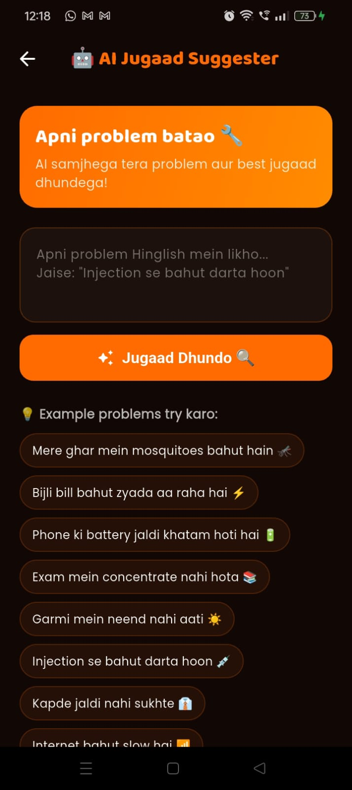
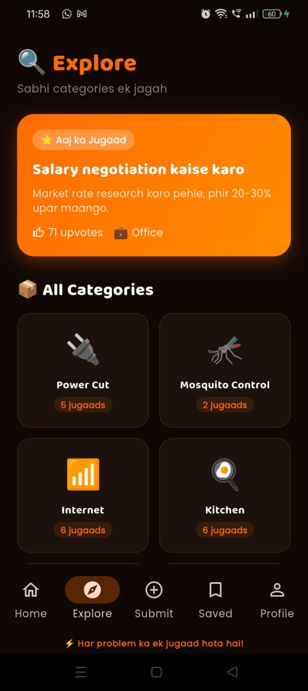
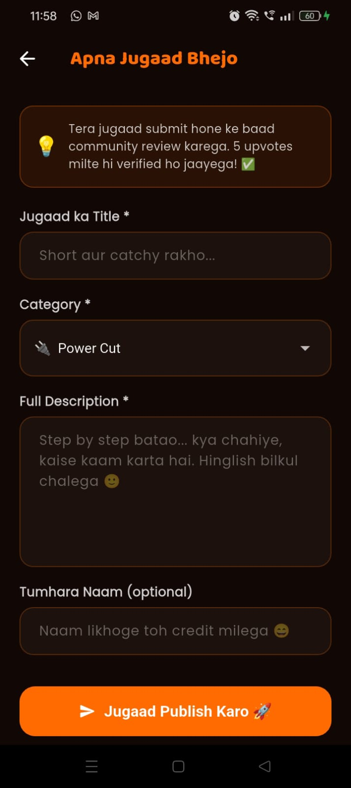
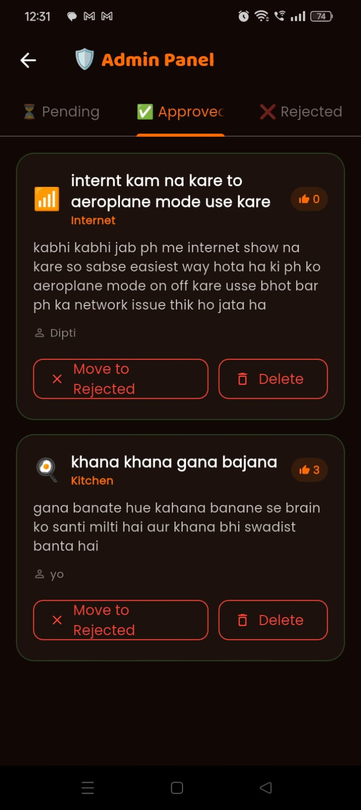

# 🚀 Jugaad Fix

<p align="center">
A community-driven Flutter application that enables users to discover, share, and save practical everyday <b>Jugaads</b>. The application also features an AI-powered assistant capable of suggesting innovative solutions based on user queries written in Hinglish.
</p>

## 📖 About

**Jugaad Fix** is a Flutter-based mobile application designed to promote innovative, low-cost, and practical solutions ("Jugaads") contributed by the community. Users can explore verified ideas, submit their own solutions, save their favourite posts, and receive AI-generated suggestions for solving everyday problems.

The application is powered by **Flutter** for cross-platform development and **Firebase** for authentication, cloud storage, and backend services, ensuring a seamless and responsive user experience.

---

# ✨ Features

- 🤖 AI Jugaad Suggester
- 🏠 Browse Community Jugaads
- 📤 Submit Your Own Jugaad
- ❤️ Like Jugaads
- 🔖 Save Favourite Jugaads
- 👤 User Profile
- 🌙 Dark Theme
- 🔔 Push Notifications
- 🛡️ Admin Verification Panel
- 🔥 Community Upvote System

---

# 🛠 Tech Stack

- Flutter
- Dart
- Firebase Authentication
- Cloud Firestore
- Firebase Storage
- Firebase Cloud Messaging
- Material Design

---

# 📱 Application Gallery

Explore the key features and user interface of **Jugaad Fix** through the screenshots below.

| 🏠 Home | 🤖 AI Jugaad Suggester |
|:-------:|:----------------------:|
|  |  |
| Browse trending jugaads, discover community solutions, and navigate across the application. | Describe your problem in Hinglish and receive AI-powered practical solutions. |

| 🔍 Explore Page | 🔖 Saved Jugaads |
|:---------------:|:----------------:|
|  |  |
| Explore verified jugaads shared by the community across different categories. | Access your bookmarked and favourite jugaads anytime. |

| 📤 Submit Jugaad | 👤 Profile |
|:----------------:|:----------:|
|  |  |
| Share your own innovative jugaads with the community for review and publication. | View your profile, activity, likes, saved posts, and contribution statistics. |

| ⚙️ Profile Settings | 🛡️ Admin Panel |
|:-------------------:|:--------------:|
|  |  |
| Manage account settings, AI tools, theme, notifications, and application preferences. | Verify community submissions and manage pending jugaads through the administrator dashboard. |
---

# 📂 Project Structure

```
Jugaad_Fix
│
├── android/
├── ios/
├── lib/
│   ├── models/
│   ├── screens/
│   ├── services/
│   ├── widgets/
│   ├── utils/
│   └── main.dart
│
├── assets/
│   ├── images/
│   └── screenshots/
│
├── web/
├── windows/
├── linux/
├── macos/
├── test/
│
├── firebase.json
├── pubspec.yaml
├── analysis_options.yaml
└── README.md
```

---

# 🚀 Getting Started

Clone the repository

```bash
git clone https://github.com/Diptanil-Sen/Jugaad_Fix.git
```

Move into the project

```bash
cd Jugaad_Fix
```

Install dependencies

```bash
flutter pub get
```

Run the project

```bash
flutter run
```

---

# 🔥 Future Improvements

- AI Chat Support
- Voice Input
- Image-based Jugaad Search
- Regional Language Support
- Personalized Recommendations
- Offline Access
- Community Leaderboard

---

---

# 👨‍💻 About the Developer

### Diptanil Sen

Computer Science and Business Systems (CSBS) Undergraduate with a strong interest in **Android Development**, **Flutter**, **Firebase**, **Artificial Intelligence**, and **Mobile Application Development**. Passionate about building scalable and user-centric applications that solve real-world problems through innovative technology.

### 📫 Contact

- 🌐 GitHub: https://github.com/Diptanil-Sen
- 💼 LinkedIn: https://www.linkedin.com/in/diptanil-sen/
- 📧 Email: diptanilsen10@gmail.com

---

### ⭐ Like this project?

If you enjoyed this project or found it useful, consider giving it a **Star ⭐** on GitHub. Your support encourages future development and improvements.

---

**Made using Flutter, Firebase, and Dart.**
